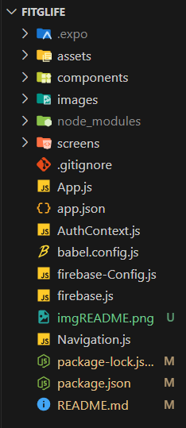
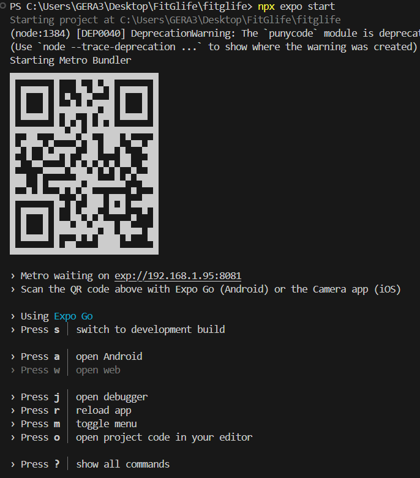

# FitGLife

FitGLife es una aplicación móvil diseñada para ayudar a los usuarios a realizar un seguimiento de sus rutinas de ejercicio y sus medidas corporales, además cuenta con herramientas motivadoras y un chat para compartir experiencias y motivarse mutuamente con la comunidad fitness. Utiliza Firebase Firestore para almacenar los datos y React Native con expo para la interfaz de usuario.

## Características

- Registro y seguimiento de rutinas de ejercicio
- Seguimiento de medidas corporales
- Visualización de datos en gráficos interactivos
- Historial de ejercicios y medidas
- Chat para compartir experiencias y motivarse mutuamente con la comunidad fitness.
- Notificaciones y auidos motivadores.

## Estructura del proyecto 
    


### Descripción de Cada Directorio y Archivo

- **.expo**: Contiene archivos generados automáticamente por Expo. No es necesario modificar estos archivos manualmente.


- **assets**: Este directorio almacena imágenes y otros recursos que se utilizan para el despliegue de la aplicación. Ejemplos incluyen logotipos, íconos y otros recursos gráficos.

- **images**: Contiene las imágenes utilizadas dentro de la aplicación. Este directorio se usa para mantener las imágenes organizadas y separadas de otros recursos.

- **components**: Este directorio incluye componentes reutilizables de React Native. Los componentes son piezas de interfaz de usuario que se pueden utilizar en diferentes partes de la aplicación.

- **node_modules**: Este directorio contiene todos los módulos y dependencias instalados por npm. Se genera automáticamente después de ejecutar `npm install`.

- **screens**: Almacena las pantallas principales de la aplicación. Cada pantalla representa una vista o una página dentro de la aplicación.

- **.gitignore**: Archivo de configuración para Git que especifica qué archivos y directorios deben ser ignorados por el control de versiones.

- **App.js**: Archivo principal de la aplicación. Aquí se configura la navegación y la estructura general de la aplicación.

- **authContext.js**: Define el contexto de autenticación utilizando React Context API. Se utiliza para gestionar el estado de autenticación de los usuarios.

- **babel.config.js**: Archivo de configuración para Babel, el transpilador de JavaScript que se utiliza para convertir el código de ES6+ a una versión compatible con todos los navegadores.

- **firebase-config.js**: Contiene la configuración de Firebase, incluyendo claves y otros detalles necesarios para conectar la aplicación a Firebase.

- **firebase.js**: Archivo para la inicialización de Firebase. Aquí se configuran los servicios de Firebase que la aplicación utiliza, como Firestore y Authentication.

- **package.json**: Archivo que contiene información sobre el proyecto, incluyendo el nombre, la versión, las dependencias y scripts de npm.

- **package-lock.json**: Archivo generado automáticamente que proporciona una descripción detallada de las dependencias instaladas en el proyecto. Asegura que las instalaciones futuras sean consistentes.

- **README.md**: Documentación del proyecto. Proporciona información sobre el propósito del proyecto, instrucciones de instalación, estructura del proyecto y otros detalles importantes.

## Requisitos

- Node.js
- npm
- Instalar Expo Go en un dispositivo movil o contar con un emulador Android.
- Conexión a internet

## Instalación

1. **Clona el repositorio:**

   ```bash
   git clone https://github.com/Gerrysan10/FitGLife.git
   cd FitGLife
    ```
2. **Instala dependecias:**
    ```bash
    npm install
    ```
    
3. **Iniciar aplicación:**
   
    ```bash
    npx expo start
    ```
    #### Al ejecutar el comando tendría que salir lo siguiente:

    
    ### Expo GO
    #### Si deseas correrlo en la aplicación de expo Go escanea el codigo dentro de la aplicación o introduce manualme la dirección de enlace.

    ### Emulador Android
    #### Si deseas ejecutarlo en tu emulador android, abre tu emulador y presiona la letra a despues de ejecutar el comando como se indicaba en la imagen anterior.
